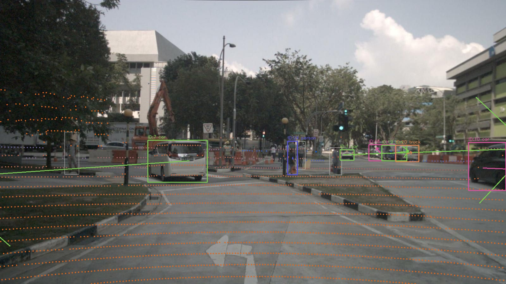

# Camera-LiDAR Sensor Fusion & Real-Time Object Tracking

A production-style ADAS perception pipeline that fuses camera and LiDAR sensor data to detect and track vehicles, trucks, and pedestrians in real time. Built and tested on the [nuScenes mini dataset](https://www.nuscenes.org/) (Singapore urban intersection scenes).

---

## Demo



> YOLOv8 detections (white boxes) fused with LiDAR point cloud (depth-coloured dots). Bold coloured boxes are Kalman-tracked objects with velocity arrows. Each colour corresponds to a unique track ID.

---

## Pipeline Overview

```
nuScenes Dataset (Camera + LiDAR)
            │
            ▼
  ┌─────────────────────┐
  │  YOLOv8 Detection   │  → 2D bounding boxes per frame
  └─────────────────────┘
            │
            ▼
  ┌─────────────────────┐
  │  LiDAR Projection   │  → 3D points projected onto image plane
  │  (extrinsic + K)    │     using rigid body transform chain
  └─────────────────────┘
            │
            ▼
  ┌─────────────────────┐
  │  Sensor Fusion      │  → LiDAR points associated with
  │  (depth per bbox)   │     each bounding box → 3D position
  └─────────────────────┘
            │
            ▼
  ┌─────────────────────┐
  │  Kalman Tracker     │  → Multi-object tracking with
  │  + Hungarian Algo   │     Hungarian assignment (SORT-style)
  └─────────────────────┘
            │
            ▼
  ┌─────────────────────┐
  │  ROS2 Node          │  → Publishes tracks to /adas/tracks
  │  (fusion_node.py)   │     at ~5Hz, mirroring real vehicle
  └─────────────────────┘        ECU communication
```

---

## Key Features

- **Camera-LiDAR fusion** — LiDAR point clouds projected onto camera image plane using calibrated extrinsic and intrinsic transforms from nuScenes
- **YOLOv8 object detection** — detects cars, trucks, buses, motorcycles, bicycles, and pedestrians
- **SORT-style Kalman tracker** — constant-velocity Kalman filter with Hungarian algorithm for data association; maintains tracks through occlusion up to 3 missed frames
- **Height filtering** — removes ground plane noise and sky/tree reflections by filtering LiDAR points outside ego-vehicle height range
- **ROS2 Jazzy deployment** — full publisher/subscriber architecture with time-synchronized camera and LiDAR topics, mirroring production ADAS ECU communication

---

## Architecture

### Standalone Pipeline (`sensor_fusion.py`)
Batch processes nuScenes scenes and saves annotated frames to disk.

### ROS2 Deployment
| File | Role |
|------|------|
| `fusion_core.py` | Core fusion logic (Kalman, projection, tracking) |
| `fusion_node.py` | ROS2 node — subscribes to sensor topics, publishes tracks |
| `nuscenes_publisher.py` | Replays nuScenes data as live ROS2 topics |

**Topics:**
| Topic | Message Type | Description |
|-------|-------------|-------------|
| `/camera/image` | `sensor_msgs/Image` | Camera frames (subscribed) |
| `/lidar/points` | `sensor_msgs/PointCloud2` | LiDAR sweeps (subscribed) |
| `/adas/tracks` | `geometry_msgs/PoseArray` | Kalman track positions (published) |
| `/adas/visualization` | `sensor_msgs/Image` | Annotated image (published) |

---

## Results

Tested on `scene-0061` (39 frames, Singapore urban intersection):

| Metric | Value |
|--------|-------|
| Peak active tracks | 18 |
| Publishing rate | ~5 Hz (CPU, WSL2) |
| Dataset | nuScenes mini v1.0 |
| Detector | YOLOv8n |
| Classes tracked | car, truck, bus, motorcycle, bicycle, person |

---

## Tech Stack

| Category | Tools |
|----------|-------|
| Language | Python 3.11 |
| Detection | YOLOv8 (Ultralytics) |
| Tracking | Kalman Filter, Hungarian Algorithm (SciPy) |
| LiDAR | NumPy point cloud processing |
| Vision | OpenCV |
| Dataset | nuScenes mini (nuscenes-devkit) |
| Middleware | ROS2 Jazzy |
| Platform | Windows 11 + WSL2 Ubuntu 24.04 |

---

## Setup & Run

### 1. Install dependencies
```bash
pip install numpy scipy opencv-python ultralytics nuscenes-devkit pyquaternion
```

### 2. Download nuScenes mini
Download `v1.0-mini` from [nuscenes.org](https://www.nuscenes.org/nuscenes#download) and extract to `./data/nuscenes/`.

### 3. Run standalone pipeline
```bash
python sensor_fusion.py nuscenes ./data/nuscenes
# Output frames saved to ./fusion_output/
```

### 4. Run as ROS2 node (requires ROS2 Jazzy)
```bash
# Terminal 1 — fusion node
cd ~/ros2_ws
colcon build --packages-select adas_fusion
source install/setup.bash
ros2 run adas_fusion fusion_node

# Terminal 2 — nuScenes data publisher
ros2 run adas_fusion nuscenes_publisher

# Terminal 3 — verify tracks publishing
ros2 topic echo /adas/tracks
```

---

## How It Works

### LiDAR → Image Projection
Each 3D LiDAR point is transformed from LiDAR sensor frame → ego-vehicle frame → camera frame using a chain of rigid body transforms (rotation + translation matrices). The camera intrinsic matrix K then maps the 3D point to a 2D pixel coordinate:

```
pixel = K @ (lidar2cam @ point_3d)
```

### Kalman Filter
State vector: `[x, y, vx, vy]` — 2D position and velocity.

- **Predict step**: projects state forward using constant-velocity motion model
- **Update step**: corrects prediction using detection measurement, weighted by Kalman Gain K
- **Kalman Gain**: balances trust between prediction and measurement based on their respective noise covariances

### Data Association
Hungarian algorithm minimizes the total cost of matching detections to existing tracks using 1-IoU as the cost metric. Unmatched detections spawn new tracks; unmatched tracks increment their miss counter and are pruned after 3 consecutive misses.

---

## What's Next
- [ ] 3D Kalman state `[x, y, z, vx, vy, vz]` using full LiDAR position
- [ ] KITTI dataset support
- [ ] CARLA simulator integration
- [ ] Extended Kalman Filter (EKF) for non-linear motion

---

## References
- [nuScenes Dataset](https://www.nuscenes.org/)
- [SORT: Simple Online and Realtime Tracking](https://arxiv.org/abs/1602.00763)
- [YOLOv8 by Ultralytics](https://github.com/ultralytics/ultralytics)
- [ROS2 Jazzy Documentation](https://docs.ros.org/en/jazzy/)
